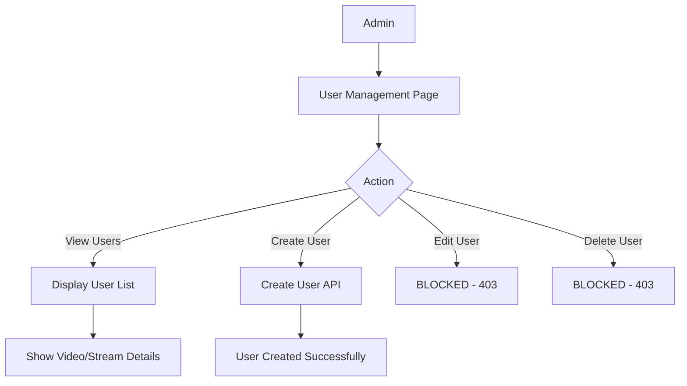

# Design Document

## Overview

Fitur User Management Restriction membatasi kemampuan Admin dalam mengelola akun user. Perubahan utama adalah:
1. Menghapus kemampuan Admin untuk menghapus user
2. Menghapus kemampuan Admin untuk mengedit user
3. Mempertahankan kemampuan Admin untuk melihat daftar user dan membuat user baru

Implementasi dilakukan dengan:
- Memodifikasi view `users.ejs` untuk menyembunyikan tombol edit dan delete
- Memodifikasi API endpoints di `app.js` untuk menolak request edit dan delete

## Architecture



## Components and Interfaces

### 1. View Layer (views/users.ejs)

**Perubahan:**
- Menghapus tombol edit dari kolom Actions
- Menghapus tombol delete dari kolom Actions
- Menghapus modal edit user
- Menghapus fungsi JavaScript terkait edit dan delete

**Interface yang dipertahankan:**
- Tombol "Create New User"
- Modal create user
- Search dan filter functionality
- Modal video dan stream details

### 2. API Layer (app.js)

**Endpoint yang dimodifikasi:**

| Endpoint | Method | Perubahan |
|----------|--------|-----------|
| `/api/users/update` | POST | Return 403 Forbidden |
| `/api/users/delete` | POST | Return 403 Forbidden |

**Endpoint yang dipertahankan:**
| Endpoint | Method | Fungsi |
|----------|--------|--------|
| `/api/users/create` | POST | Membuat user baru |
| `/api/users/:id/videos` | GET | Mendapatkan video user |
| `/api/users/:id/streams` | GET | Mendapatkan stream user |
| `/users` | GET | Menampilkan halaman user management |

### 3. Response Format

**Error Response untuk Edit/Delete:**
```json
{
  "success": false,
  "message": "User editing is not allowed"
}
```

```json
{
  "success": false,
  "message": "User deletion is not allowed"
}
```

## Data Models

Tidak ada perubahan pada data model. Model `User` tetap sama.

## Correctness Properties

*A property is a characteristic or behavior that should hold true across all valid executions of a system-essentially, a formal statement about what the system should do. Properties serve as the bridge between human-readable specifications and machine-verifiable correctness guarantees.*

### Property 1: Delete API Always Rejects

*For any* user ID yang dikirim ke endpoint `/api/users/delete`, sistem harus mengembalikan HTTP status 403 dengan response `{ success: false, message: "User deletion is not allowed" }`.

**Validates: Requirements 1.2, 1.3**

### Property 2: Update API Always Rejects

*For any* request ke endpoint `/api/users/update` dengan data apapun (userId, username, role, status, password, avatar), sistem harus mengembalikan HTTP status 403 dengan response `{ success: false, message: "User editing is not allowed" }`.

**Validates: Requirements 2.2, 2.3**

### Property 3: UI Hides Edit and Delete Buttons

*For any* user yang ditampilkan di halaman User Management, output HTML tidak boleh mengandung tombol edit (dengan onclick="editUser") dan tombol delete (dengan onclick="deleteUser").

**Validates: Requirements 1.1, 2.1**

### Property 4: Create User Still Works

*For any* data user yang valid (username unik, password tidak kosong), request ke endpoint `/api/users/create` harus berhasil membuat user baru dan mengembalikan `{ success: true }`.

**Validates: Requirements 4.3**

## Error Handling

| Scenario | HTTP Status | Response |
|----------|-------------|----------|
| Admin mencoba edit user | 403 | `{ success: false, message: "User editing is not allowed" }` |
| Admin mencoba delete user | 403 | `{ success: false, message: "User deletion is not allowed" }` |
| Create user dengan username duplikat | 400 | `{ success: false, message: "Username already exists" }` |
| Create user tanpa username/password | 400 | `{ success: false, message: "Username and password are required" }` |

## Testing Strategy

### Unit Testing

Unit tests akan memverifikasi:
1. API endpoint `/api/users/delete` mengembalikan 403
2. API endpoint `/api/users/update` mengembalikan 403
3. API endpoint `/api/users/create` tetap berfungsi normal

### Property-Based Testing

Menggunakan library **fast-check** untuk JavaScript property-based testing.

Setiap property-based test harus:
- Menjalankan minimal 100 iterasi
- Ditandai dengan komentar yang mereferensikan correctness property
- Format tag: `**Feature: user-management-restriction, Property {number}: {property_text}**`

**Property tests yang akan diimplementasi:**
1. Delete API rejection property - generate random user IDs, verify all rejected
2. Update API rejection property - generate random update data, verify all rejected
3. Create API success property - generate valid user data, verify creation succeeds
