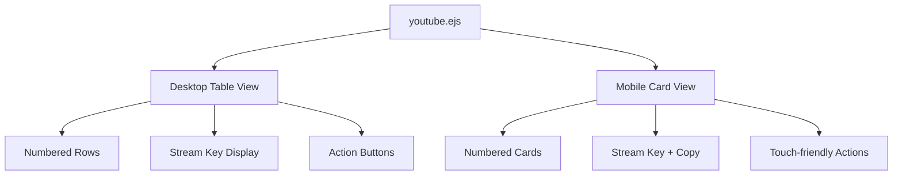

# Design Document: YouTube Broadcast List Redesign

## Overview

Redesign tampilan daftar "Scheduled Broadcasts" di halaman YouTube Sync untuk memberikan tampilan yang lebih rapi dan ringkas. Perubahan utama meliputi:
- Menghilangkan thumbnail untuk tampilan lebih compact
- Menambahkan nomor urut untuk setiap broadcast
- Menampilkan stream key sebagai informasi utama
- Mempertahankan fungsi edit, copy (reuse), dan delete
- Memperbaiki layout mobile untuk responsivitas yang lebih baik

## Architecture

Perubahan ini bersifat frontend-only dan hanya mempengaruhi file `views/youtube.ejs`. Tidak ada perubahan pada backend, API, atau database.



## Components and Interfaces

### 1. Desktop Table Component

Layout berbasis tabel untuk layar desktop (≥768px):

| Column | Content | Width |
|--------|---------|-------|
| No | Nomor urut (1, 2, 3...) | 50px |
| Title | Judul broadcast + channel name + privacy status | flex |
| Schedule | Tanggal dan waktu | 150px |
| Stream Key | Stream key dengan tombol copy | 280px |
| Actions | Edit, Copy, Delete buttons | 120px |

### 2. Mobile Card Component

Layout berbasis card untuk layar mobile (<768px):

```
┌─────────────────────────────────────┐
│ #1  Title                    public │
│     Channel Name                    │
│     📅 Dec 19, 2025  ⏰ 15:47       │
│ ┌─────────────────────────────┬───┐ │
│ │ stream-key-here             │ 📋│ │
│ └─────────────────────────────┴───┘ │
│ [✏️ Edit] [📋 Copy] [🗑️ Delete]     │
└─────────────────────────────────────┘
```

### 3. Action Buttons Interface

```javascript
// Edit broadcast
editBroadcast(broadcastId, accountId)

// Copy/Reuse broadcast  
reuseBroadcast(broadcastId, accountId)

// Delete broadcast
deleteBroadcast(broadcastId, title, accountId)

// Copy stream key to clipboard
copyStreamKey(streamKey)
```

## Data Models

Tidak ada perubahan pada data model. Menggunakan struktur broadcast yang sudah ada:

```javascript
{
  id: string,
  title: string,
  channelName: string,
  privacyStatus: 'public' | 'unlisted' | 'private',
  scheduledStartTime: Date,
  streamKey: string,
  thumbnailUrl: string, // tidak digunakan dalam tampilan baru
  accountId: number
}
```

## Correctness Properties

*A property is a characteristic or behavior that should hold true across all valid executions of a system-essentially, a formal statement about what the system should do. Properties serve as the bridge between human-readable specifications and machine-verifiable correctness guarantees.*

### Property 1: Sequential Numbering
*For any* array of broadcasts rendered in the list, the displayed numbers SHALL be sequential integers starting from 1, where the nth item displays number n.
**Validates: Requirements 1.1, 1.3**

### Property 2: Required Fields Display
*For any* broadcast object with valid data, the rendered output SHALL contain the broadcast title, channel name, privacy status, scheduled date/time, and stream key.
**Validates: Requirements 2.3, 3.1**

### Property 3: Action Buttons Presence
*For any* broadcast item rendered in the list, the output SHALL contain exactly three action buttons: edit, copy (reuse), and delete.
**Validates: Requirements 4.1**

## Error Handling

| Scenario | Handling |
|----------|----------|
| Stream key is null/empty | Display "No stream key" placeholder |
| Broadcast title is too long | Truncate with ellipsis (CSS) |
| Copy to clipboard fails | Show error toast notification |
| Empty broadcast list | Show empty state message |

## Testing Strategy

### Unit Testing

Unit tests akan memverifikasi:
- Rendering nomor urut yang benar
- Placeholder untuk stream key kosong
- Keberadaan action buttons

### Property-Based Testing

Menggunakan **fast-check** library untuk JavaScript property-based testing.

Property tests akan memverifikasi:
1. **Property 1**: Untuk array broadcasts dengan panjang N, nomor yang ditampilkan adalah 1 sampai N secara berurutan
2. **Property 2**: Untuk setiap broadcast dengan data lengkap, semua field required ada di output
3. **Property 3**: Untuk setiap broadcast item, terdapat 3 action buttons

Setiap property test akan:
- Menjalankan minimal 100 iterasi
- Menggunakan generator untuk membuat data broadcast random
- Di-tag dengan format: `**Feature: youtube-broadcast-list-redesign, Property {number}: {property_text}**`

